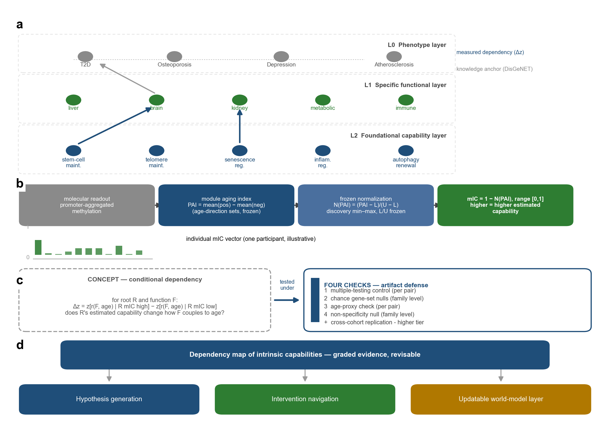
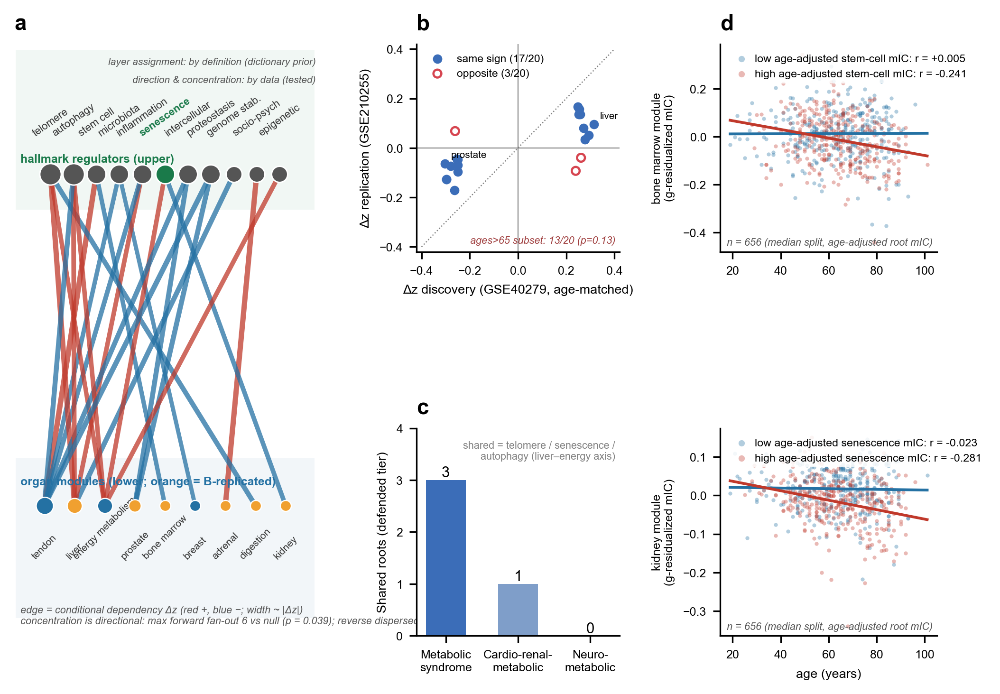

<div align="center">

# RootMap: Mapping Conditional Dependencies Between Aging Hallmarks and Organ-Aging Patterns
# RootMap：映射衰老标志与器官衰老模式的条件依赖

**A Longevity Medicine Framework Based on Blood DNA Methylation**
**基于血液 DNA 甲基化的长寿医学框架**

[](https://steeramed.com)
[](LICENSE)
[](https://github.com/DeepoMe/SteeraMed-RootMap/releases/tag/v1)

</div>

---

[English](#english) | [中文](#中文)

---

<a name="english"></a>

## Which foundational capabilities condition which organ functions as we age?

RootMap is a module of the [SteeraMed](https://steeramed.com) framework. It maps
conditional dependencies between aging-hallmark capabilities (maintenance, repair,
renewal) and organ-aging patterns — using blood DNA methylation from 656 discovery
and 1,394 replication participants.

Each of 332 gene modules is scored as a **module-level intrinsic capability (mIC)**.
A **conditional dependency** is a difference in an organ module's association with
age between participants with higher vs. lower age-adjusted mIC for a hallmark module.

### Framework overview



*332 gene modules organized into a modern system (14 hallmark + 3 functional pillars) and a parallel TCM system (38 concepts).*

### Modern-medicine dependency route



*Conditional dependency edges between hallmark modules (left) and organ modules (right). Stem-cell maintenance was the broadest marker in the discovery cohort, relating to 12 organ modules.*

## Key findings

- **22 hallmark–organ pairs** passed four artifact checks; **17 of 20** replication-list pairs kept their direction
- **Stem cell → bone marrow**: among people with higher stem-cell-maintenance mIC, bone-marrow mIC was negatively associated with age (r = −0.241); among those with lower mIC, near zero (r = +0.005)
- **Asymmetric pattern**: hallmark modules more often marked differences in organ–age associations than organs marked differences in hallmark–age associations
- **PPI screening benchmark**: filtering a PPI-ranked anti-aging candidate list by functional-layer labels made it **2.8× more compact** (hit enrichment 3.19→8.87-fold)
- Discovery dependency effect sizes were **associated with replication dependencies** (ρ = +0.153, p = 0.005), whereas the tested PPI-proximity measures were not
- **TCM analysis**: essence was the largest hub (5 of 10 significant fundamental-substance pairs); the TCM concept "liver" corresponded more strongly to lymph/immune modules than to the anatomical liver

## Repository status

> **Version 1 (preprint).** This repository provides the framework overview,
> representative figures, and version declaration. The analysis code, frozen
> result CSVs, module definitions, supplementary tables, and reproduction
> scripts will be released in **version 2 (v2)**.

## Data sources

- Discovery cohort: 656 participants (blood DNA methylation, Illumina 450K)
- Replication cohort: 1,394 participants
- Module library: 332 predefined gene modules (ref. [7])
- Public GEO datasets used for scoring and validation

## Citation

```bibtex
@preprint{xiong2026rootmap,
  title={RootMap: A Longevity Medicine Framework for Mapping Conditional
         Dependencies Between Aging Hallmarks and Organ-Aging Patterns},
  author={Xiong, Jianghui},
  year={2026},
  note={Preprint. Code and frozen artifacts:
        https://github.com/DeepoMe/SteeraMed-RootMap}
}
```

## Links

- **[SteeraMed](https://steeramed.com)** — the broader framework
- **[DeepoMe](https://steeramed.com)** — the organization behind this work
- **[SteeraMed-MorbidMap](https://github.com/DeepoMe/SteeraMed-MorbidMap)** — companion candidate-ranking repository
- **[SteeraMed-bench](https://github.com/DeepoMe/SteeraMed-bench)** — companion benchmark repository

## License

MIT (code) / CC BY 4.0 (data and documentation)

## Contact

Jianghui Xiong — [jianghui@deepome.com](mailto:jianghui@deepome.com)

---

<a name="中文"></a>

## 哪些基础能力影响着我们衰老时哪些器官功能？

RootMap 是 [SteeraMed](https://steeramed.com) 框架的模块。它基于 656 名发现队列和
1,394 名复制队列参与者的血液 DNA 甲基化数据，映射衰老标志能力（维护/修复/更新）
与器官衰老模式之间的条件依赖。

332 个基因模块中的每一个都被评分为**模块级内在能力（mIC）**。
**条件依赖** = 在标志模块 mIC 较高 vs 较低的参与者中，器官模块与年龄关联的差异。

### 框架总览


*332 个基因模块组织为现代体系（14 个衰老标志 + 3 个功能支柱）和平行的中医体系（38 个概念）。*

### 现代医学依赖路线


*衰老标志模块（左）与器官模块（右）之间的条件依赖边。干细胞维护是发现队列中最广泛的标记，关联 12 个器官模块。*

## 核心发现

- **22 对标志-器官**通过四项伪影检查；复制列表 20 对中 **17 对**保持方向
- **干细胞 → 骨髓**：干细胞维护 mIC 较高者，骨髓 mIC 与年龄负关联（r = −0.241）；较低者近零（r = +0.005）
- **不对称模式**：标志模块更常标记器官-年龄关联的差异，反向则较少
- **PPI 筛选基准**：按功能层标签过滤 PPI 排序的抗衰老候选列表，使列表**紧凑 2.8 倍**（命中富集 3.19→8.87 倍）
- 发现队列依赖效应量与**复制队列依赖相关**（ρ = +0.153, p = 0.005），而测试的 PPI 邻近度则不相关
- **中医分析**：精是最大枢纽（10 对重要基本物质对中的 5 对）；中医"肝"对应淋巴/免疫模块强于对应解剖肝

## 仓库状态

> **版本 1（预印本）。** 当前提供框架总览、代表性图表与版本声明。
> 分析代码、冻结结果 CSV、模块定义、补充表格与复现脚本将在**版本 2（v2）**中发布。

## 许可

MIT（代码）/ CC BY 4.0（数据与文档）

## 联系方式

熊江辉 — [jianghui@deepome.com](mailto:jianghui@deepome.com)

[DeepoMe](https://steeramed.com) · [SteeraMed](https://steeramed.com)
